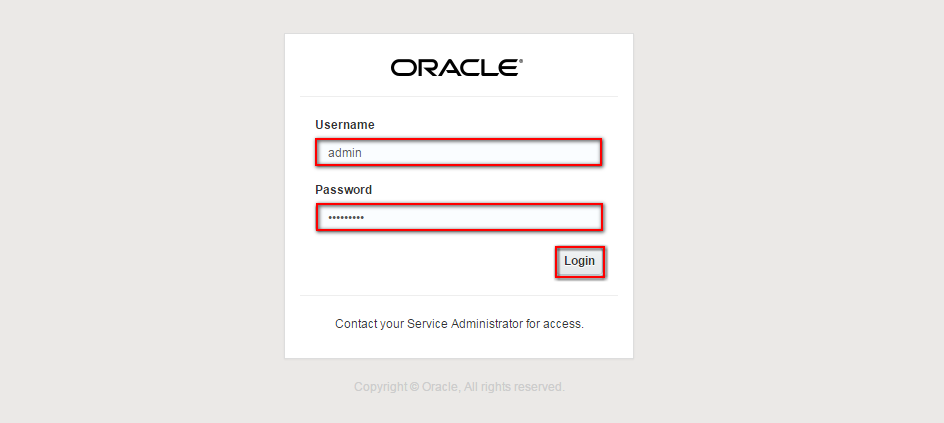
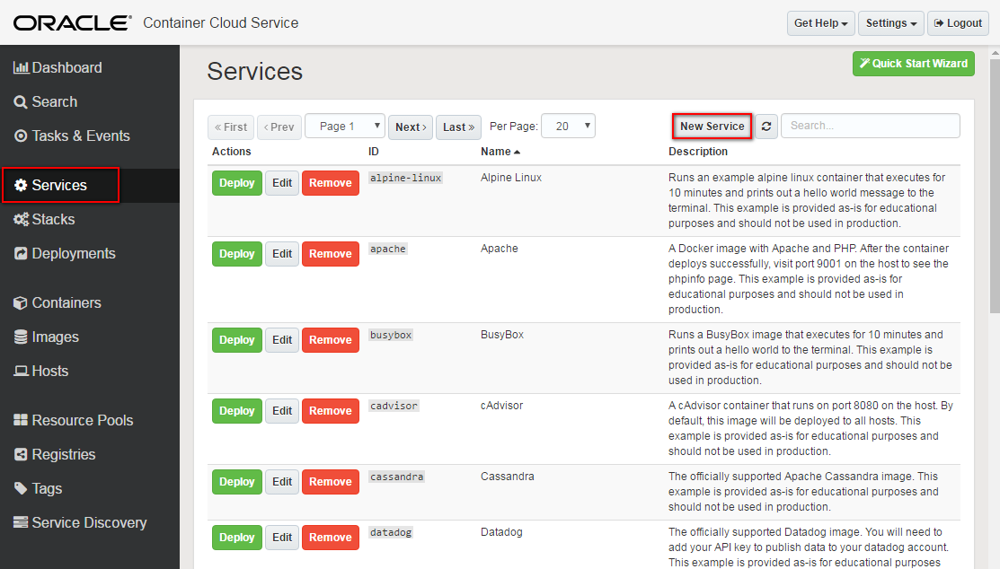

---
# ORACLE Cloud-Native DevOps workshop #

## Build Spring Boot container packaged application using Wercker and deploy to Oracle Container Cloud Service ##

### About this tutorial ###
**Wercker** is a Docker-Native CI/CD  Automation platform for Kubernetes & Microservice Deployments. Wercker is integrated with Docker containers, which package up application code and can be easily moved from server to server. Each build artifact can be a Docker container. The user can take the container from the Docker Hub or his private registry and build the code before shipping it. Its SaaS platform enables developers to test and deploy code often. They can push software updates incrementally as they are ready, rather than in bundled dumps. It makes it easier for coders to practice continuous integration, a software engineering practice in which each change a developer makes to the codebase is constantly tested in the process so that software doesn’t break when it goes live.

Wercker is based on the concept of pipelines, which are automated workflows. Pipelines take pieces of code and automatically execute a series of steps upon that code. The Wercker API provides programmatic access to information about applications, builds and deploys. There are code snippets available for Golang, Node.js and Python.

**Oracle Container Cloud Service** provides an easy and quick way to create an enterprise-grade container infrastructure. It delivers comprehensive tooling to compose, deploy, orchestrate and manage Docker container-based applications on the Oracle Public Cloud. It is designed to provision a ready to run containerized infrastructure quickly, that can be used as a test infrastructure, with a limited lifespan, or operated as a production environment for long running container applications.

Oracle Container Cloud Service supports running Docker containers and images, and associated technologies such as *Docker Compose*.

**Architecture**

The key components of Wercker:

+ **Step** is self-contained bash script or compiled binary for accomplishing specific automation tasks.
+ **Pipelines** are a series of steps that are triggered on a git push or the completion of another pipeline.
+ **Workflows** are a set of chained and branched pipelines that allow you to form multi-stage, multi-branch complex CI/CD flows that take your project from code to production. 
+ All Wercker pipelines execute inside a **Docker container** and every build artefact can be a Docker container.
+ With Wercker you can **push your images to any container registry** public or private such as Docker.

This tutorial demonstrates how to:

- create Wercker application (CI/CD) to build and push Spring Boot sample included image to Docker repository
- deploy containerized Spring Boot application to Oracle Container Cloud Service from Docker registry

### Prerequisites ###

- [Github](https://github.com) account
- [Oracle Public Cloud Service](https://cloud.oracle.com) account including Container Cloud Service
- [Docker](https://cloud.docker.com/) account to have Docker registry.

----

#### Create Oracle Container Cloud Service instance ####

First create Oracle Container Cloud Service. Sign in to [https://cloud.oracle.com/sign-in](https://cloud.oracle.com/sign-in). Select your datacenter then provide the identity domain and credentials. After a successful login you will see your Dashboard. Find the Container tile and click the hamburger icon. In the dropdown menu click **Open Service Console**.

If it is the first time you launch this console then click **Go To Console** button on the Wizard page. Otherwise click immediately the **Create Service** button.

On the details page configure the service.

+ **Service Name**: name of the instance. E.g. *testOCCS*
+ **Description**: short description of the service. Can be anything which describes the purpose of this service.
+ **SSH Public Key**: to connect to the worker and master nodes you need to define your public key of your SSH keypair. Press the **Edit** button. In case if you already have one and you want to use that select the public key file or copy of that content into Key Value textfield. Otherwise and for test purposes I recommend to generate a new one. Select **Create a New Key** option and click **Enter**. A popup dialog will open which enables to download the newly generated key pair. It is important to have this key pair for later usage of this service. In case if you lost or forget where you saved the key pair you can [add new one](https://docs.oracle.com/cloud/latest/computecs_common/OCSUG/GUID-65AA23D4-5F57-4EF6-9704-C8E16932C0AD.htm#OCSUG233) using the My Services Dashboard.

+ **Metering Frequency**: based on your subscription. Leave the default.
+ **Admin Username**: administrator's username of Container Cloud Service's console. You can leave the default.
+ **Admin Password**: administrator's password. Please note the password what you choose.
+ **Worker node Compute Shape**: the capacity of the service. For this sample the minimum is more than enough.
+ **Number of worker nodes**: The number of worker nodes which run the Docker containers. For this sample the default 1 node is enough. One node can execute more containers even if that share one OCPU only. Every worker node has a public IP address assigned what makes the running application publicly available.
+ **Worker node data volume size (GB)**: Leave the default.

Once all the details are configured click **Next**.

Check again the configuration and submit the instance provision request by clicking **Next**.

While the Container Cloud Service provisioning completes move forward to sign up Docker and create Wercker continous integration setup. 

#### Deploy Spring Boot sample Docker container to Oracle Container Cloud Service ####

Find your browser (tab) where you created Container Cloud Service at the beginning of this lab. If you hit the timeout or lost the browser (tab) then sign in again to [https://cloud.oracle.com/sign-in](https://cloud.oracle.com/sign-in). Select your datacenter then provide the identity domain and credentials. After a successful login you will see your Dashboard. Find the Container tile and click the hamburger icon. In the dropdown menu click **Open Service Console**.

Now you have to see your *testOCCS* (or different if you specified other name) Container Cloud Service instance ready. Click on the hamburger icon on the left and select **Container Console** from the dropdown menu.

Due to the reason that the certification hasn't been setup you will get a security warning. Ignore that and allow to open the page. Enter the Administrator's credential for your Container Cloud Service. If you followed the guide the username has to be *admin*. Click **Login**.

First you need to define your new Service. The new service will comprise all of the necessary configuration for running your Docker container on a host, plus default deployment options. Click **Services** on the left navigation menu than click **New Service** button.

Enter the following parameters to define your new service:

+ **Service Name**: *wercker-springboot* (can be anything)
+ **Service Description**: anything to describe your service.
+ **Image**: *YOUR\_DOCKER\_USERNAME/wercker-springboot* (the name of your Docker image stored in your registry) see previos step when checked your Docker registry.
+ **Ports**: first opt in the Ports on the right side. Then it will populate Ports attribute list.

When *Ports* **+Add** button appears click to define port mapping. This port mapping enables internal docker container's port redirection to different port on the host. Spring Boot sample application uses 8080 what you will map to host's 8090 port.

+ **Host Port**: 8090
+ **Container Port**: 8080
+ **Protocol**: TCP

Click **Save**.

Click **Save** on service details page.

Find your new service in the list. It can happen that you need to jump to the next page of the list. Click on **Deploy** next to your service.

Orchestration can be part of service configuration and you can define during the deployment here. This lab doesn't focus on this so leave default everything except the Deployment Name. It is usefule to add unique name however Container Cloud Service will apppend the deployment date to the name. Click **Deploy**.

The next page will show the progress of the pull and container startup. If everything went well you should see just one button as Red. Every other should be green! To check the application you need to get the host's public IP address first. Click on the hostname link.

This page shows detailed information and status of the selected host. Find the *public_ip* label and note the IP address next to it.

Open a new browser (tab) and enter or copy the host's public IP address and append the 8090 port. For example: `141.144.137.89:8090` You have to get the following webpage:

Please note your name what you inserted on *welcome.jsp* page.

Optionally [add *wercker-occs-container-util* step](wercker.step.occs.md) step to automatically restart Oracle Container Cloud Service when change happens on the application.
